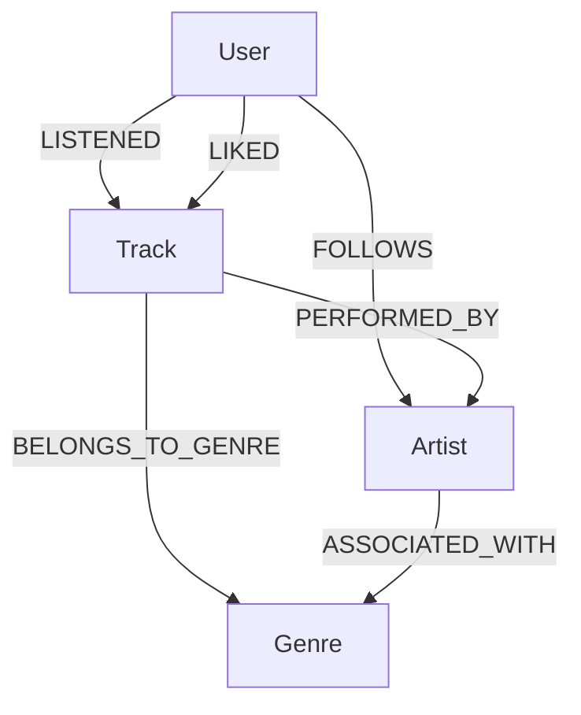

# Sistema de Recomendação Musical com Neo4j

Projeto desenvolvido para o desafio prático da DIO com foco em **banco de dados em grafos utilizando Neo4j**.

O objetivo é construir um sistema de recomendação musical baseado em grafos, modelando usuários, músicas, artistas, gêneros e interações como escutas, curtidas e seguidores. A partir dessas conexões, o projeto utiliza consultas em **Cypher** para gerar recomendações personalizadas e responder perguntas analíticas sobre comportamento musical.

---

## 1. Contexto do Problema

Plataformas de streaming musical *precisam recomendar novas músicas de forma personalizada*. Para isso, *não basta analisar apenas atributos isolados* das músicas. ***É necessário compreender as conexões*** entre:

- usuários;
- músicas;
- artistas;
- gêneros;
- preferências explícitas;
- histórico de escuta;
- usuários com comportamento semelhante.

Esse tipo de problema é naturalmente conectado. Por isso, bancos de dados em grafos são uma excelente alternativa para representar e consultar essas relações.

---

## 2. Objetivo do Projeto

Construir um grafo musical no Neo4j para responder perguntas como:

- *Quais músicas foram mais escutadas?*
- *Quais músicas receberam mais curtidas?*
- *Quais artistas possuem mais seguidores?*
- *Quais gêneros concentram mais interações?*
- *Que músicas podem ser recomendadas para um usuário com base nos gêneros que ele curtiu?*
- *Que músicas podem ser recomendadas com base nos artistas que ele segue?*
- *Que músicas podem ser recomendadas a partir de usuários semelhantes?*

---

## 3. Por que usar Grafos?

Em um modelo relacional tradicional, responder perguntas de recomendação geralmente exige múltiplos joins entre tabelas de usuários, músicas, artistas, gêneros e interações.

Em um banco de dados em grafos, as relações são parte central do modelo. Isso torna consultas de recomendação mais naturais, pois elas podem ser expressas como caminhos no grafo.

Exemplos de caminhos utilizados neste projeto:

```text
Usuário → Música curtida → Gênero → Nova música recomendada
```

```text
Usuário → Artista seguido → Música ainda não ouvida
```

```text
Usuário → Música curtida em comum → Usuário semelhante → Nova música curtida
```

---

## 4. Tecnologias Utilizadas

- Neo4j
- Cypher
- CSV
- Git/GitHub
- Dataset sintético controlado
- Neo4j Browser para visualização do grafo

---

## 5. Estrutura do Repositório

```text
dio-neo4j-music-recommendation-graph/
│
├── README.md
│
├── data/
│   ├── users.csv
│   ├── tracks.csv
│   ├── artists.csv
│   ├── genres.csv
│   ├── user_listened_tracks.csv
│   ├── user_liked_tracks.csv
│   └── user_followed_artists.csv
│
├── cypher/
│   ├── 01_constraints.cypher
│   ├── 02_load_nodes.cypher
│   ├── 03_load_relationships.cypher
│   ├── 04_business_queries.cypher
│   └── 05_recommendation_queries.cypher
│
├── docs/
│   ├── graph_model.md
│   ├── business_questions.md
│   └── troubleshooting.md
│
├── assets/
│   ├── schema-visualization.png
│   ├── query-most-listened-tracks.png
│   ├── query-top-genres.png
│   ├── query-recommendation-by-genre.png
│   ├── query-recommendation-by-artist.png
│   ├── query-recommendation-by-similar-users.png
│   └── query-recommendation-path.png
│
└── scripts/
    └── generate_sample_data.py
```

---

## 6. Modelo do Grafo

### 6.1 Labels

| Label    | Descrição                                 |
| -------- | ----------------------------------------- |
| `User`   | Representa usuários da plataforma musical |
| `Track`  | Representa músicas/faixas                 |
| `Artist` | Representa artistas                       |
| `Genre`  | Representa gêneros musicais               |

---

### 6.2 Relacionamentos

| Relacionamento     | Origem   | Destino  | Descrição                             |
| ------------------ | -------- | -------- | ------------------------------------- |
| `LISTENED`         | `User`   | `Track`  | Usuário escutou uma música            |
| `LIKED`            | `User`   | `Track`  | Usuário curtiu uma música             |
| `FOLLOWS`          | `User`   | `Artist` | Usuário segue um artista              |
| `PERFORMED_BY`     | `Track`  | `Artist` | Música é interpretada por um artista  |
| `BELONGS_TO_GENRE` | `Track`  | `Genre`  | Música pertence a um gênero           |
| `ASSOCIATED_WITH`  | `Artist` | `Genre`  | Artista associado ao gênero principal |

---

### 6.3 Diagrama Conceitual



---

## 7. Dataset

O projeto utiliza um dataset sintético criado para demonstrar o funcionamento de um sistema de recomendação musical em grafos.

### Arquivos utilizados

| Arquivo                     | Descrição                         |
| --------------------------- | --------------------------------- |
| `users.csv`                 | Usuários da plataforma            |
| `tracks.csv`                | Músicas disponíveis               |
| `artists.csv`               | Artistas                          |
| `genres.csv`                | Gêneros musicais                  |
| `user_listened_tracks.csv`  | Histórico de escutas dos usuários |
| `user_liked_tracks.csv`     | Músicas curtidas pelos usuários   |
| `user_followed_artists.csv` | Artistas seguidos pelos usuários  |

---

## 8. Como Executar o Projeto

### 8.1 Pré-requisitos

É necessário ter:

- Neo4j Desktop, Neo4j AuraDB ou outro ambiente Neo4j disponível;
- acesso ao Neo4j Browser;
- arquivos CSV disponíveis para importação.

---

### 8.2 Gerar os dados sintéticos

Execute o script Python:

```bash
python scripts/generate_sample_data.py
```

Esse script gera os arquivos CSV dentro da pasta `data/`.

---

### 8.3 Copiar os CSVs para a pasta `import` do Neo4j

O comando `LOAD CSV` utilizado neste projeto espera encontrar os arquivos na pasta `import` do banco Neo4j.

No Neo4j Desktop, acesse:

```text
Database → Open folder → Import
```

Copie para essa pasta os arquivos:

```text
users.csv
tracks.csv
artists.csv
genres.csv
user_listened_tracks.csv
user_liked_tracks.csv
user_followed_artists.csv
```

---

### 8.4 Executar os scripts Cypher

Execute os arquivos na seguinte ordem:

```text
cypher/01_constraints.cypher
cypher/02_load_nodes.cypher
cypher/03_load_relationships.cypher
cypher/04_business_queries.cypher
cypher/05_recommendation_queries.cypher
```

---

## 9. Validações de Carga

Após executar a carga, valide a quantidade de nós:

```cypher
MATCH (n)
RETURN labels(n) AS label, count(n) AS total
ORDER BY total DESC;
```

Valide também a quantidade de relacionamentos:

```cypher
MATCH ()-[r]->()
RETURN type(r) AS relacionamento, count(r) AS total
ORDER BY total DESC;
```

---

## 10. Consultas Analíticas

O arquivo `cypher/04_business_queries.cypher` contém consultas para responder perguntas como:

### 10.1 Músicas mais escutadas

```cypher
MATCH (:User)-[r:LISTENED]->(t:Track)
RETURN
    t.track_id AS track_id,
    t.track_name AS musica,
    sum(r.play_count) AS total_execucoes,
    count(r) AS usuarios_que_escutaram
ORDER BY total_execucoes DESC
LIMIT 10;
```

### 10.2 Músicas mais curtidas

```cypher
MATCH (:User)-[r:LIKED]->(t:Track)
RETURN
    t.track_id AS track_id,
    t.track_name AS musica,
    count(r) AS total_curtidas
ORDER BY total_curtidas DESC
LIMIT 10;
```

### 10.3 Artistas mais seguidos

```cypher
MATCH (:User)-[r:FOLLOWS]->(a:Artist)
RETURN
    a.artist_id AS artist_id,
    a.artist_name AS artista,
    count(r) AS total_seguidores
ORDER BY total_seguidores DESC
LIMIT 10;
```

### 10.4 Gêneros com maior volume de escuta

```cypher
MATCH (:User)-[r:LISTENED]->(t:Track)-[:BELONGS_TO_GENRE]->(g:Genre)
RETURN
    g.genre_id AS genre_id,
    g.genre_name AS genero,
    sum(r.play_count) AS total_execucoes,
    count(DISTINCT t) AS musicas_distintas,
    count(DISTINCT r) AS interacoes
ORDER BY total_execucoes DESC;
```

---

## 11. Consultas de Recomendação

O arquivo `cypher/05_recommendation_queries.cypher` implementa diferentes estratégias de recomendação.

---

### 11.1 Recomendação por gênero curtido

Essa estratégia recomenda músicas pertencentes a gêneros que o usuário já demonstrou gostar.

Caminho utilizado:

```text
User → LIKED → Track → BELONGS_TO_GENRE → Genre ← BELONGS_TO_GENRE ← Track
```

Consulta:

```cypher
MATCH (u:User {user_id: 'U001'})-[:LIKED]->(:Track)-[:BELONGS_TO_GENRE]->(g:Genre)
WITH u, g, count(*) AS afinidade_genero

MATCH (rec:Track)-[:BELONGS_TO_GENRE]->(g)

WHERE NOT EXISTS {
    MATCH (u)-[:LISTENED|LIKED]->(rec)
}

RETURN
    u.user_name AS usuario,
    rec.track_id AS track_id,
    rec.track_name AS recomendacao,
    g.genre_name AS genero_base,
    rec.popularity AS popularidade,
    afinidade_genero AS forca_afinidade
ORDER BY forca_afinidade DESC, rec.popularity DESC
LIMIT 10;
```

---

### 11.2 Recomendação por artista seguido

Essa estratégia recomenda músicas de artistas que o usuário segue, excluindo músicas já escutadas ou curtidas.

Caminho utilizado:

```text
User → FOLLOWS → Artist ← PERFORMED_BY ← Track
```

---

### 11.3 Recomendação por usuários semelhantes

Essa estratégia encontra usuários com curtidas em comum e recomenda músicas curtidas por esses usuários semelhantes.

Caminho utilizado:

```text
User → LIKED → Track ← LIKED ← Similar User → LIKED → Recommended Track
```

---

### 11.4 Ranking híbrido simples

Também foi criada uma consulta de ranking híbrido, combinando sinais de:

- músicas em comum;
- usuários semelhantes;
- popularidade da música;
- reforço por gênero.

O objetivo é criar uma recomendação simples, interpretável e explicável.

---

## 12. Evidências Visuais

### 12.1 Schema do Grafo


---

### 12.2 Músicas mais escutadas


---

### 12.3 Gêneros com maior volume de escuta


---

### 12.4 Recomendação por gênero


---

### 12.5 Recomendação por artista


---

### 12.6 Recomendação por usuários semelhantes


---

### 12.7 Caminho visual da recomendação


---

## 13. Troubleshooting

Durante o desenvolvimento, alguns pontos exigiram atenção:

- localização correta dos arquivos CSV na pasta `import` do Neo4j;
- uso correto do prefixo `file:///` no `LOAD CSV`;..
- conversão de campos numéricos com `toInteger()`;
- conversão de datas com `date()`;
- uso de `MERGE` para evitar duplicidade de nós e relacionamentos;
- criação de constraints antes da carga dos dados;
- validação das recomendações quando o dataset sintético retorna poucos caminhos.

A documentação completa está disponível em:

```text
docs/troubleshooting.md
```

---

## 14. Principais Aprendizados

Este projeto demonstrou na prática que bancos de dados em grafos são especialmente adequados para problemas de recomendação, pois permitem explorar conexões entre entidades de forma intuitiva e eficiente.

Aprendizados principais:

- modelagem de domínio em grafo;
- criação de labels e relacionamentos;
- carga de dados CSV no Neo4j;
- uso de constraints para controle de unicidade;
- escrita de consultas Cypher analíticas;
- construção de recomendações baseadas em caminhos;
- geração de evidências visuais no Neo4j Browser;
- documentação técnica com foco em portfólio.

---

## 15. Conclusão

O projeto implementa um MVP de sistema de recomendação musical com Neo4j, representando usuários, músicas, artistas, gêneros e interações em um grafo.

A solução demonstra como recomendações podem surgir naturalmente a partir das conexões entre usuários e conteúdos musicais, utilizando estratégias como recomendação por gênero, artista seguido e usuários semelhantes.

Além de atender ao desafio proposto, o projeto foi estruturado como uma entrega de portfólio, com dataset, scripts Cypher, documentação, troubleshooting e evidências visuais.

---

## 16. Autor

**Roberto dos Santos Soares**  
Projeto desenvolvido para fins educacionais e de portfólio na área de bancos de dados em grafos, Neo4j e sistemas de recomendação.
