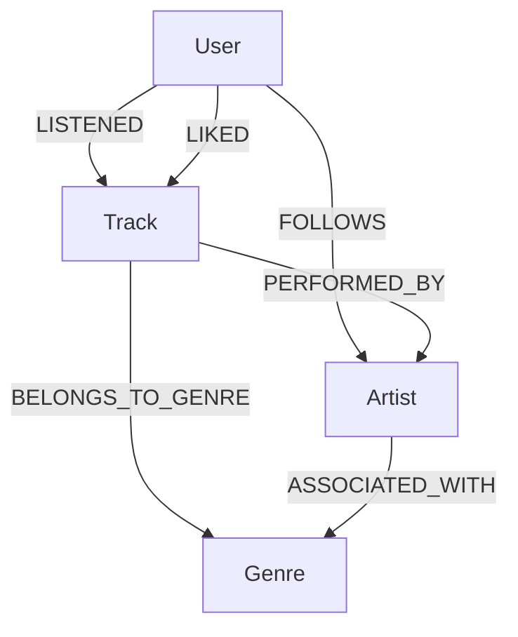

---
# Modelo do Grafo


Este documento descreve a modelagem do grafo utilizada no projeto Sistema de Recomendação Musical com Neo4j.

---

## 1. Visão Geral

O grafo representa um domínio musical com usuários, músicas, artistas, gêneros e interações de consumo.

A modelagem foi construída para permitir análises e recomendações a partir das relações entre essas entidades.

---

## 2. Nós

| Label    | Chave       | Propriedades principais                        |
| -------- | ----------- | ---------------------------------------------- |
| `User`   | `user_id`   | `user_name`                                    |
| `Track`  | `track_id`  | `track_name`, `duration_seconds`, `popularity` |
| `Artist` | `artist_id` | `artist_name`, `main_genre_id`                 |
| `Genre`  | `genre_id`  | `genre_name`                                   |

---

## 3. Relacionamentos

| Relacionamento     | Origem   | Destino  | Propriedades                   |
| ------------------ | -------- | -------- | ------------------------------ |
| `LISTENED`         | `User`   | `Track`  | `play_count`, `last_played_at` |
| `LIKED`            | `User`   | `Track`  | `liked_at`                     |
| `FOLLOWS`          | `User`   | `Artist` | `since`                        |
| `PERFORMED_BY`     | `Track`  | `Artist` | —                              |
| `BELONGS_TO_GENRE` | `Track`  | `Genre`  | —                              |
| `ASSOCIATED_WITH`  | `Artist` | `Genre`  | —                              |

---

## 4. Diagrama Conceitual



---

## 5. Decisões de Modelagem

### 5.1 Usuários como nós

Usuários foram modelados como nós porque possuem múltiplas conexões com músicas e artistas.

---

### 5.2 Músicas como nós centrais

As músicas são o principal objeto de recomendação. Por isso, foram modeladas como nós `Track`.

---

### 5.3 Gêneros como nós

Os gêneros foram modelados como nós, e não apenas como propriedades, porque são usados como pontos de conexão para recomendação.

Isso permite caminhos como:

```
User → Track → Genre → Track
```

---

### 5.4 Interações como relacionamentos

As ações dos usuários foram modeladas como relacionamentos:

- `LISTENED`
- `LIKED`
- `FOLLOWS`

Essa escolha permite capturar comportamento diretamente nas arestas do grafo.

---

## 6. Estratégias de Recomendação Suportadas

O modelo suporta três estratégias principais:

1. Recomendação por gênero curtido.
2. Recomendação por artista seguido.
3. Recomendação por usuários semelhantes.

---

## 7. Conclusão

A modelagem em grafo permite representar o domínio musical de forma conectada e facilita a construção de recomendações personalizadas e explicáveis.

---

---


## Texto final para entrega na DIO

Na plataforma da DIO, use este texto:

```text
Desenvolvi um sistema de recomendação musical utilizando Neo4j e Cypher, com foco em modelagem de dados em grafos.

O projeto representa usuários, músicas, artistas, gêneros e interações como escutas, curtidas e artistas seguidos. A partir dessas conexões, foram criadas consultas Cypher para responder perguntas analíticas e gerar recomendações personalizadas com base em gênero musical, artista seguido e usuários semelhantes.

A entrega inclui dataset sintético em CSV, scripts de criação de constraints, carga de nós, carga de relacionamentos, queries analíticas, queries de recomendação, documentação técnica, modelo do grafo, troubleshooting e evidências visuais geradas no Neo4j Browser.

Link do projeto:
https://github.com/roberto-ssoares/Data-Science-Graph-Analytics/tree/main/dio-neo4j-music-recommendation-graph
```

---

## Commit final da documentação

Depois de salvar os arquivos:

```powershell
git status

git add README.md docs/troubleshooting.md docs/business_questions.md docs/graph_model.md

git commit -m "docs: add premium readme and troubleshooting documentation"

git push
```

---

## Status após esta etapa

| Entrega                            | Status |
| ---------------------------------- | ------:|
| Repositório criado no GitHub       | ✅ OK   |
| Estrutura de pastas criada         | ✅ OK   |
| Dataset sintético em CSV           | ✅ OK   |
| Constraints Cypher                 | ✅ OK   |
| Script de carga de nós             | ✅ OK   |
| Script de carga de relacionamentos | ✅ OK   |
| Queries analíticas                 | ✅ OK   |
| Queries de recomendação            | ✅ OK   |
| Prints do Neo4j Browser            | ✅ OK   |
| README premium                     | ✅ OK   |
| Troubleshooting documentado        | ✅ OK   |
| Link final para entrega na DIO     | ✅ OK   |

Agora o projeto está com cara de entrega completa: **código, grafo, dados, queries, evidências e documentação profissional**.


